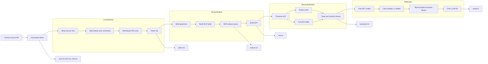
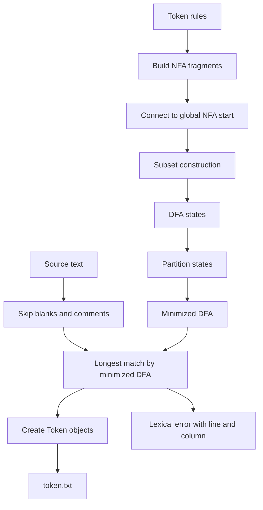
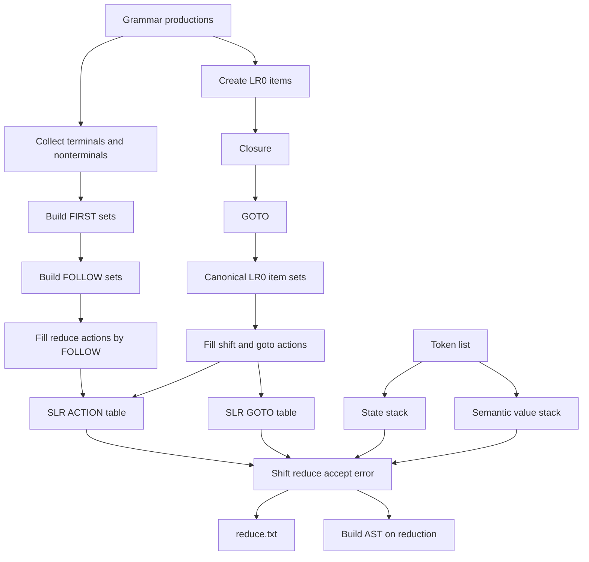
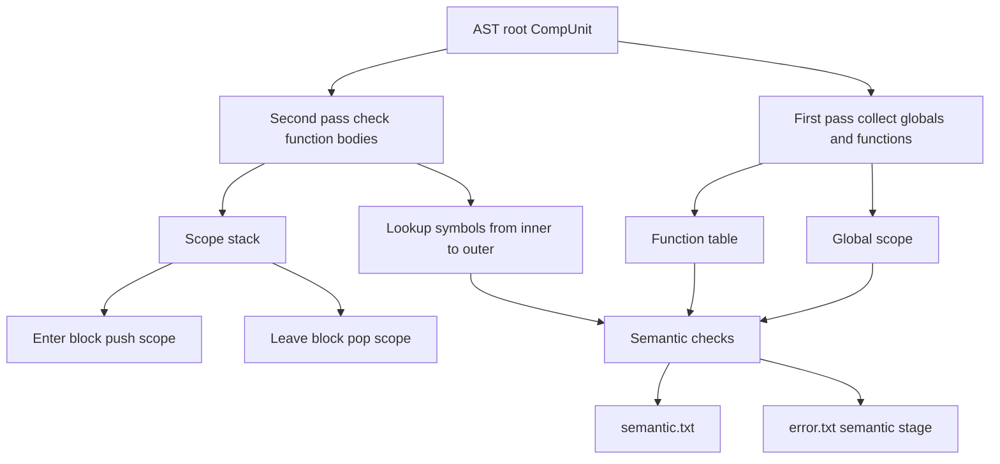
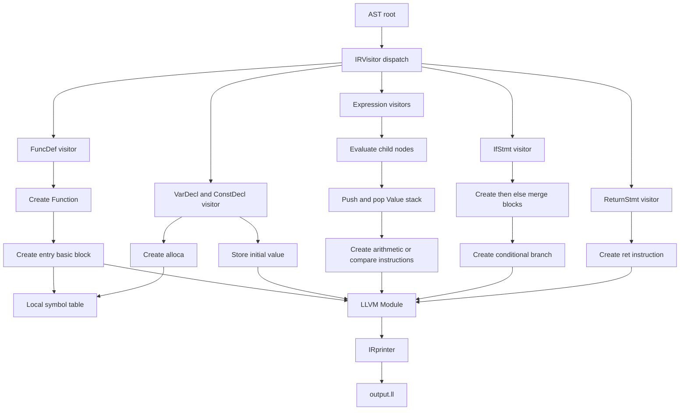
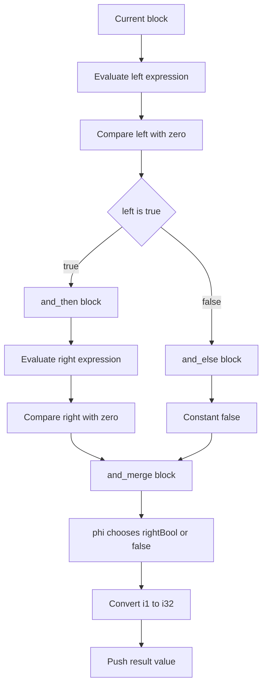

# C-- 编译器设计报告

## 1. 项目目标与总体结构

本项目实现了一个面向 C-- 语言的编译器前端与中间代码生成工具。整体流程按照课程要求分为词法分析、语法分析、AST 构建、语义分析和 LLVM IR 生成几个阶段。最终工具 `c--compiler` 可以按阶段单独运行，也可以默认执行完整编译流程。

整体数据流如下：



项目主要目录划分如下：

```text
src/lexer      词法分析：NFA/DFA 构造、DFA 最小化、扫描器
src/parser     语法分析：SLR 表构造、移进规约、AST 构建
src/semantic   语义分析：符号表、作用域、类型、函数调用检查
src/ir         中间代码生成：遍历 AST，调用 compiler_ir 生成 LLVM IR
src/tools      命令行 IDE：实时词法/语法检查和高亮
include/c--    公共数据结构和各模块头文件
tests          回归测试样例和测试脚本
third_part     课程提供的 compiler_ir 中端代码
```

设计上我们没有把所有逻辑混在一个主程序中，而是让每一阶段都有明确输入和输出：

| 阶段 | 输入 | 输出 | 主要代码 |
|---|---|---|---|
| 词法分析 | 源代码字符串 | `LexResult`、`token.txt` | `src/lexer` |
| 语法分析 | Token 序列 | `ParseResult`、`reduce.txt`、`ast.txt` | `src/parser` |
| 语义分析 | AST | `SemanticResult`、`semantic.txt` | `src/semantic` |
| IR 生成 | AST | `IRResult`、`output.ll` | `src/ir` |

其中，正式提交时最关键的两个前端输出格式按大作业文档规定处理：

```text
token.txt:  单词符号<TAB><单词符号种别,单词符号内容>
reduce.txt: 序号<TAB>栈顶符号#面临输入符号<TAB>执行动作
```

`reduce.txt` 中的执行动作只输出 `move`、`reduction`、`accept` 或 `error`，避免混入额外调试信息。

这种分层的意义是：每个阶段既能独立测试，也能串成完整流程。出现错误时，主程序会停止后续阶段，并把错误阶段写入 `run_info.txt`，方便定位问题。

## 2. 公共数据结构设计

各阶段之间主要通过 `include/c--/common/Common.h` 中的数据结构传递结果。

```cpp
struct Token {
    std::string lexeme;
    TokenType type;
    std::string grammar;
    std::string attr;
    int line = 1;
    int column = 1;
};
```

`Token` 同时服务两个目标：

- `lexeme`、`type`、`attr` 用于输出词法分析结果。
- `grammar` 用于语法分析，例如 `Ident`、`IntConst`、`+`、`return`。

这样设计可以避免 Parser 再去判断原始字符串属于哪类终结符。词法分析器已经完成的分类结果可以直接复用。

各阶段返回值也采用统一风格：

```cpp
struct LexResult {
    bool success = false;
    std::vector<Token> tokens;
    std::string errorMessage;
};

struct ParseResult {
    bool success = false;
    std::unique_ptr<ASTNode> root;
    std::vector<std::string> reduceLogs;
    std::string errorMessage;
};

struct SemanticResult {
    bool success = false;
    std::vector<std::string> logs;
    std::string errorMessage;
};

struct IRResult {
    bool success = false;
    std::string irText;
    std::string errorMessage;
};
```

这里没有让各阶段直接退出程序，而是返回结果对象。这样主程序可以统一处理成功、失败、输出文件和运行信息，模块测试也更方便。

## 3. 词法分析器设计

### 3.1 设计目标

词法分析部分按照课程要求手写自动机，不使用 Lex/Flex 等工具。实现内容包括：

- 根据词法规则构造 NFA。
- 使用子集构造法将 NFA 转换为 DFA。
- 对 DFA 做最小化。
- 使用最小化 DFA 对源代码做最长匹配。
- 输出 token 序列，并记录词法错误位置。

核心代码位于：

- `src/lexer/automata.cpp`
- `include/c--/lexer/automata.h`
- `src/lexer/lexer.cpp`

词法模块内部结构如下：



### 3.2 自动机构造

自动机模块中定义了 `NFAState`、`DFAState`、`TokenRule` 等结构。`TokenRule` 保存一条词法规则的类别、属性和优先级。

例如关键字、运算符、界符、标识符、整数、浮点数都会被整理成规则，再接入一个统一的 NFA 起始状态。之后执行：

```cpp
globalDFA = nfaToDfa(globalNFA, globalRules);
globalMinDFA = minimizeDfa(globalDFA, globalRules);
```

`nfaToDfa` 实现的是标准子集构造法。DFA 的一个状态对应一组 NFA 状态，转移过程是：

```text
DFA 状态 S
  -> 对每个输入字符 ch
  -> 找到 S 中所有 NFA 状态经过 ch 能到达的状态集合
  -> 对该集合求 epsilon 闭包
  -> 得到新的 DFA 状态
```

`minimizeDfa` 对 DFA 状态进行等价类划分。初始时按是否接受、接受规则是否相同分组，之后不断根据转移目标是否落在同一组来细分，直到不能继续细分。这样可以减少扫描时的状态数量。

### 3.3 扫描器最长匹配

扫描入口是 `Lexer::tokenize`：

```cpp
LexResult Lexer::tokenize(const std::string& source) {
    const DFA& dfa = getMinimizedDFA();
    const std::vector<TokenRule>& rules = getTokenRules();
    ...
}
```

扫描器从当前位置 `pos` 出发，在 DFA 中向前走，同时记录最近一次到达接受态的位置：

```cpp
int state = dfa.start;
int cursor = pos;
int lastAcceptRule = -1;
int lastAcceptPos = -1;
```

如果后续无法继续转移，就回到最近的接受态位置，生成对应 token。这就是“最长匹配”原则。例如 `>=` 应该识别为一个运算符，而不是先识别 `>` 再识别 `=`。

对于关键字和标识符冲突，例如 `int` 同时符合标识符规则，项目通过规则优先级解决：关键字规则优先于普通标识符规则。

### 3.4 空白、注释和错误处理

扫描时会跳过空白字符，并更新行号列号。后来增加了注释支持：

```cpp
if (current == '/' && pos + 1 < length && source[pos + 1] == '/') {
    ...
}

if (current == '/' && pos + 1 < length && source[pos + 1] == '*') {
    ...
}
```

`//` 注释跳过到行尾，`/* ... */` 注释跳过到结束符。如果多行注释没有闭合，会返回词法错误。

词法分析器遇到非法字符时不会立即崩溃，而是记录：

```text
Lexical error at line x, column y: unexpected character ...
```

这样做的意义是错误信息能直接对应源代码位置，也方便 IDE 实时提示。

## 4. 语法分析器设计

### 4.1 为什么选择 SLR

课程要求手写 SLR 语法分析器。SLR 属于自底向上的 LR 分析方法，适合表达式、语句、函数定义等语法结构。相比递归下降，SLR 的重点是自动构造项目集和分析表，更能体现编译原理课程中的 FIRST/FOLLOW、LR(0) 项目集和 ACTION/GOTO 表。

语法分析核心代码在 `src/parser/parser.cpp`。整体流程如下：



### 4.2 文法和产生式

项目中用 `Production` 表示产生式：

```cpp
struct Production {
    std::string lhs;
    std::vector<std::string> rhs;
    std::string tag;
};
```

其中 `lhs` 和 `rhs` 是文法本身，`tag` 是规约时构造 AST 的语义动作标记。例如：

```cpp
add("Stmt", {"LVal", "=", "Exp", ";"}, "assign_stmt");
add("Stmt", {"return", "ReturnExpOpt", ";"}, "return_stmt");
add("AddExp", {"AddExp", "AddOp", "MulExp"}, "binary_expr");
```

`tag` 的意义是把“语法识别”和“AST 构建”连接起来。Parser 规约到 `assign_stmt` 时，就知道要构造 `AssignStmt` 节点；规约到 `binary_expr` 时，就知道要构造 `BinaryExpr` 节点。

顶层文法做了左因子化。因为变量声明和函数定义都可能以 `Type Name` 开头：

```c
int a;
int add(int x, int y) { ... }
```

如果直接让 SLR 在 `int Ident` 后二选一，容易产生冲突。因此当前文法先统一识别 `Type Name`，再根据后续符号判断是函数定义还是变量声明。这种设计减少了分析表冲突，使文法更适合 SLR。

### 4.3 FIRST 和 FOLLOW 集

`Grammar::buildFirst` 使用迭代算法计算 FIRST 集：

```cpp
bool changed = true;
while (changed) {
    changed = false;
    for (size_t i = 0; i < productions.size(); i++) {
        ...
    }
}
```

核心思想是不断把右部符号的 FIRST 集加入左部，直到集合不再变化。

`Grammar::buildFollow` 同样使用迭代算法。对于产生式：

```text
A -> α B β
```

会把 `FIRST(β)` 中非空符号加入 `FOLLOW(B)`；如果 `β` 可以推出空，则继续把 `FOLLOW(A)` 加入 `FOLLOW(B)`。

FOLLOW 集在 SLR 中非常重要，因为规约动作不是对所有终结符都生效，而是只在产生式左部的 FOLLOW 集上生效。

### 4.4 LR(0) 项目集规范族

项目用 `Item` 表示 LR(0) 项目：

```cpp
struct Item {
    int production = 0;
    int dot = 0;
};
```

例如：

```text
Stmt -> LVal . = Exp ;
```

表示已经识别了 `LVal`，下一个希望看到 `=`。

项目集构造包括两个关键函数：

```cpp
std::set<Item> closure(const std::set<Item>& input) const;
std::set<Item> goTo(const std::set<Item>& state, const std::string& symbol) const;
```

`closure` 的含义是：如果点后面是某个非终结符，就把该非终结符的所有产生式加入项目集。

`goTo` 的含义是：项目集读入一个符号后，点向右移动一格，再对新项目集求闭包。

构造状态集时从开始项目出发，不断对所有可能符号执行 `goTo`，产生新的项目集状态，最终得到 LR(0) 项目集规范族。

### 4.5 SLR ACTION/GOTO 表

`SLRTable::buildTables` 根据项目集构造分析表：

- 如果点后面是终结符，填入 Shift。
- 如果点后面是非终结符，填入 GOTO。
- 如果点在产生式末尾，则对 FOLLOW(lhs) 中的终结符填入 Reduce。
- 如果归约到开始符号，则填入 Accept。

代码中也对经典的 dangling else 冲突做了处理：遇到 `else` 时优先移进，使 `else` 绑定到最近的 `if`。

```cpp
if (old->second.type == ActionType::Shift &&
    action.type == ActionType::Reduce &&
    terminal == "else") {
    return;
}
```

这个设计符合 C 语言一类语法中 `else` 就近匹配的习惯。

### 4.6 移进规约过程与 AST 构造

Parser 使用两个栈：

- `stateStack`：保存 SLR 状态。
- `valueStack`：保存语义值，包括 token 文本、源码位置、AST 节点等。

主循环位于 `Parser::parse`：

```cpp
while (index < input.size()) {
    int state = stateStack.back();
    std::string lookahead = input[index].grammar.empty()
        ? input[index].lexeme
        : input[index].grammar;
    ...
}
```

移进时压入新状态和当前 token 的语义值；规约时弹出右部长度对应的状态和值，根据产生式 `tag` 调用 `buildSemantic` 构造 AST，再通过 GOTO 表进入新状态。

这种设计的意义是：语法分析和 AST 构建同步进行。语法分析结束时，栈顶语义值中的 `ast` 就是完整的 AST 根节点。

## 5. AST 设计

AST 节点定义在 `include/c--/parser/AST.h`：

```cpp
struct ASTNode {
    std::string name;
    std::string value;
    int line = -1;
    int column = -1;
    std::vector<ASTNode*> children;
};
```

各字段含义：

- `name`：节点类型，例如 `FuncDef`、`ReturnStmt`、`BinaryExpr`。
- `value`：节点附加值，例如函数名、变量名、整数值、运算符。
- `line` / `column`：源码位置。
- `children`：有序子节点。

AST 的设计原则是“保留语义需要的信息，去掉纯语法符号”。例如括号、分号、逗号不会单独成为 AST 节点，因为它们对后续语义分析和 IR 生成没有直接作用。

例子：

```c
int main() {
    return 3 + 4;
}
```

对应 AST 可以理解为：

```text
CompUnit
  FuncDef value=main
    Type value=int
    ParamList
    Block
      ReturnStmt
        BinaryExpr value=+
          IntLiteral value=3
          IntLiteral value=4
```

AST 是语法分析和后端之间的核心接口。只要 AST 节点类型和子节点顺序稳定，语义分析和 IR 生成就不需要关心具体 SLR 分析细节。

## 6. 语义分析设计

### 6.1 独立语义阶段的意义

早期实现中，一些语义错误可能在 IR 生成时才暴露，例如未定义变量、函数参数数量不匹配等。后来将语义分析独立出来，形成 `src/semantic/SemanticAnalyzer.cpp`。

语义分析模块设计如下：



这样做有三个意义：

- 错误阶段更清楚：语法正确但语义错误时，不会误报为 IR 生成错误。
- IR 生成更简单：IRGenerator 可以假设输入 AST 已经过基本语义检查。
- 更接近真实编译器结构：前端通常会在生成 IR 前完成符号和类型检查。

### 6.2 符号表和函数表

语义分析器内部维护两类信息：

```cpp
std::vector<std::map<std::string, SymbolInfo> > scopes;
std::map<std::string, FunctionInfo> functions;
```

`scopes` 是作用域栈。进入代码块时压入新作用域，离开代码块时弹出。查找变量时从内层向外层查找，因此支持局部变量遮蔽外层变量。

`functions` 保存函数签名，包括返回类型和参数类型。分析 `CompUnit` 时会先收集函数定义，再检查函数体，这样函数调用可以通过函数表判断参数数量和类型。

### 6.3 检查内容

当前语义分析主要检查：

- AST 根节点是否为 `CompUnit`。
- 是否存在 `main` 函数。
- 同一作用域内变量或常量是否重复定义。
- 变量使用前是否已经定义。
- 常量是否被赋值。
- 变量初始化、赋值、返回值类型是否匹配。
- 函数调用是否存在，实参数量和类型是否匹配。
- `void` 表达式是否被错误用于条件、运算或返回值。
- `%` 是否只用于 `int`。

例如赋值语句检查逻辑是：

```cpp
SymbolInfo* symbol = findSymbol(lval->value);
if (symbol == NULL) {
    fail("undefined variable ...");
}
if (symbol->isConst) {
    fail("cannot assign to const ...");
}
```

这部分体现了语义分析和语法分析的区别：语法上 `a = 1;` 是正确的，但如果 `a` 没有定义，或者 `a` 是常量，就必须由语义分析报错。

### 6.4 关于 float 的处理

根据老师回复，本次大作业不强制要求完整支持浮点常量初始化和浮点运算 IR。我们的处理方式是：

- 词法和语法阶段能识别 `float` 与浮点常量。
- 语义分析允许类型一致的 `float` 声明和表达式通过。
- IR 生成阶段对未支持的浮点初始化、浮点运算给出错误提示。

这样既满足基础要求，也明确保留了实现边界。

## 7. 中间代码生成设计

### 7.1 基本思路

IR 生成模块位于 `src/ir/IRGenerator.cpp`。它采用访问 AST 的方式，根据不同节点生成对应 LLVM IR。底层 IR 对象和输出由课程提供的 `third_part/compiler_ir` 完成。

整体流程可以表示为：



`IRGenerator::generate` 对外只暴露一个入口：

```cpp
IRResult IRGenerator::generate(const ASTNode *root);
```

如果生成成功，返回 LLVM IR 文本；如果遇到当前不支持的语言特性，则返回错误信息。

### 7.2 变量、表达式和函数

函数定义会创建 `Function`，然后创建入口基本块。局部变量声明一般通过 `alloca` 分配空间，通过 `store` 保存初始值。表达式求值后把结果压入一个值栈，父节点再弹出使用。

二元表达式根据运算符生成不同指令：

- `+`、`-`、`*`、`/`、`%` 生成整数算术指令。
- `==`、`!=`、`<`、`<=`、`>`、`>=` 生成比较指令。
- `&&`、`||` 使用短路求值单独处理。

这种设计和 AST 结构对应清楚：`BinaryExpr` 的 `value` 保存运算符，两个子节点分别是左右操作数。

### 7.3 条件语句和基本块

`if/else` 的 IR 生成核心是基本块和条件跳转：

```text
condition
  true  -> then block
  false -> else block 或 merge block
then block -> merge block
else block -> merge block
```

基本块名称带计数器，避免嵌套 `if` 时出现重复 label。这个设计解决了多层控制流生成时最容易出现的命名冲突问题。

### 7.4 && 和 || 的短路求值

老师指出 `compiler_ir` 中 `create_iand`、`create_ior` 当前实现不可靠。因此我们没有直接调用这两个接口，而是在 `handleLogicalAnd` 和 `handleLogicalOr` 中使用条件跳转、基本块和 `phi` 指令生成短路逻辑。

逻辑与 `a && b` 的控制流是：



逻辑或 `a || b` 则相反：如果左值为真，直接得到真；只有左值为假时才计算右表达式。

这种实现比直接生成普通二元运算更符合 C 语言逻辑表达式语义，也避免了第三方库相关接口的问题。

## 8. 命令行工具和 IDE

项目主程序在 `src/main.cpp`，支持按阶段执行：

```bash
build/c--compiler lexer tests/ok_001_minimal_return.sy
build/c--compiler parser tests/ok_001_minimal_return.sy
build/c--compiler semantic tests/ok_001_minimal_return.sy
build/c--compiler ir tests/ok_001_minimal_return.sy
build/c--compiler tests/ok_001_minimal_return.sy
```

如果不指定阶段，默认执行完整流程。

除此之外，项目还实现了一个基于 `ncurses` 的终端 IDE，代码在 `src/tools/cminus_editor.cpp`。它不是课程基本要求，但有助于展示编译器前端的实时分析能力：

- 左侧编辑 C-- 代码。
- 右上显示词法分析结果。
- 右下显示语法分析结果。
- 支持基础编辑、保存、取消修改、光标移动。
- 支持实时错误提示、语法高亮和 token 关联高亮。

IDE 的设计意义是把编译器各阶段做成可交互工具，而不是只能通过命令行一次性运行。

## 9. 测试设计

测试样例位于 `tests/`，命名规则按失败阶段区分：

```text
ok_*.sy              完整流程应通过
lex_error_*.sy       词法阶段应失败
parse_error_*.sy     语法阶段应失败
semantic_error_*.sy  语义阶段应失败
ir_error_*.sy        IR 生成阶段应失败
ir_invalid_*.sy      编译器生成 IR，但 clang 校验应失败
```

测试脚本包括：

```bash
scripts/run_sample_lexer.sh
scripts/run_sample_parser.sh
scripts/run_sample_semantic.sh
scripts/run_sample_ir.sh
scripts/run_samples.sh
```

测试覆盖点包括：

- 正确程序：函数、变量、常量、表达式优先级、括号、一元运算、`if/else`、函数调用、作用域、注释、逻辑短路。
- 词法错误：非法字符、不完整浮点数、非 ASCII 字符、未支持字符串、未闭合注释等。
- 语法错误：缺少分号、关键字作标识符、括号/花括号不匹配、错误参数列表、不支持 `while`。
- 语义错误：未定义变量、重复定义、函数实参数量错误。
- IR 边界：浮点运算、全局变量、部分第三方库能力不足场景。

目前回归测试结果为：

```text
lexer sample test:    36 passed, 0 failed
parser sample test:   36 passed, 0 failed
semantic sample test: 36 passed, 0 failed
ir sample test:       36 passed, 0 failed
full sample test:     36 passed, 0 failed
```

测试设计的重点不是只证明“正确样例能跑”，而是让每个阶段都有对应的错误样例，能证明编译器在正确阶段报错。

## 10. 当前实现范围与不足

当前已经完成的核心能力：

- 手写自动机词法分析。
- NFA 到 DFA 的确定化。
- DFA 最小化。
- SLR 语法分析表构造。
- FIRST/FOLLOW、LR(0) 项目集规范族。
- 移进/规约过程输出。
- AST 构建。
- 独立语义分析。
- int 类型主要 IR 生成。
- `if/else` 控制流。
- 函数定义、函数调用、返回语句。
- `&&`、`||` 短路求值 IR。
- 命令行工具和终端 IDE。

当前边界和不足：

- `float` 在词法和语法层面支持，但 IR 层不完整，符合老师说明的基本要求边界。
- 暂不支持数组。
- 暂不支持 `while`、`break`、`continue`。
- 暂不支持输入输出语句。
- 暂未实现完整的可执行文件一键生成选项。
- IR 优化尚未实现。

这些不足不影响当前大作业基本要求，但适合作为后续长期维护方向。

## 11. 总结

本项目的核心思路是按照真实编译器前端结构拆分模块：词法分析负责把字符流转成 token，语法分析负责用 SLR 判断 token 序列是否合法并构造 AST，语义分析负责检查符号和类型，IR 生成负责把 AST 转换为 LLVM IR。

其中最能体现课程算法要求的是词法阶段的 NFA/DFA/最小化，以及语法阶段的 FIRST/FOLLOW、LR(0) 项目集和 SLR 分析表。AST 和语义分析则把前端结果组织成后续 IR 生成可以稳定使用的数据结构。整体实现既满足课程要求，也为后续扩展循环、数组、输入输出、完整浮点 IR 和优化阶段留下了清晰接口。
